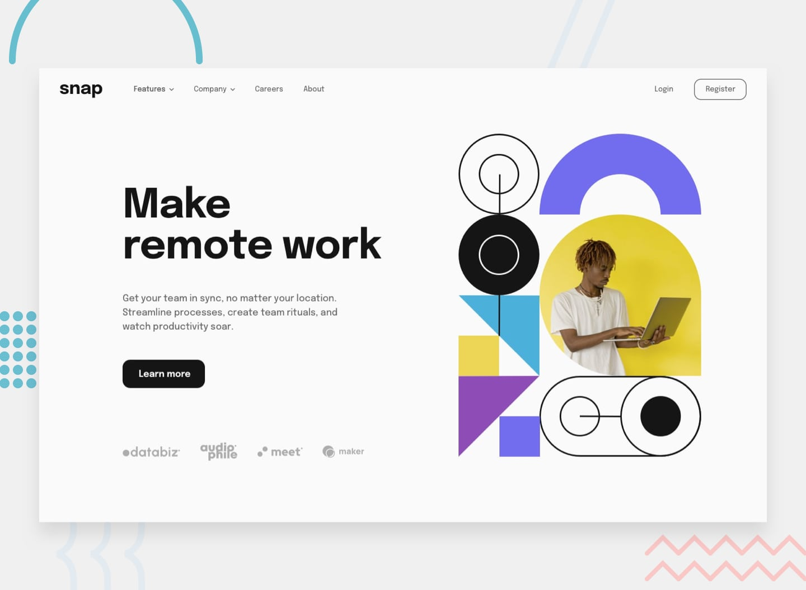

# intro-section-with-dropdown-navigation

# Front-end Style Guide

## Layout

The designs were created to the following widths:

- Mobile: 375px
- Desktop: 1440px

# Design screenshots

# Active-states

# Desktop-design

# Desktop-preview

# Mobile-design

# Mobile-menu-expanded

# Mobile-menu-collapsed

## Colors

### Neutral

- Almost White: hsl(0, 0%, 98%)
- Medium Gray: hsl(0, 0%, 41%)
- Almost Black: hsl(0, 0%, 8%)

## Typography

### Body Copy

- Font size (paragraph): 18px

### Font

- Family: [Epilogue](https://fonts.google.com/specimen/Epilogue)
- Weights: 500, 700
